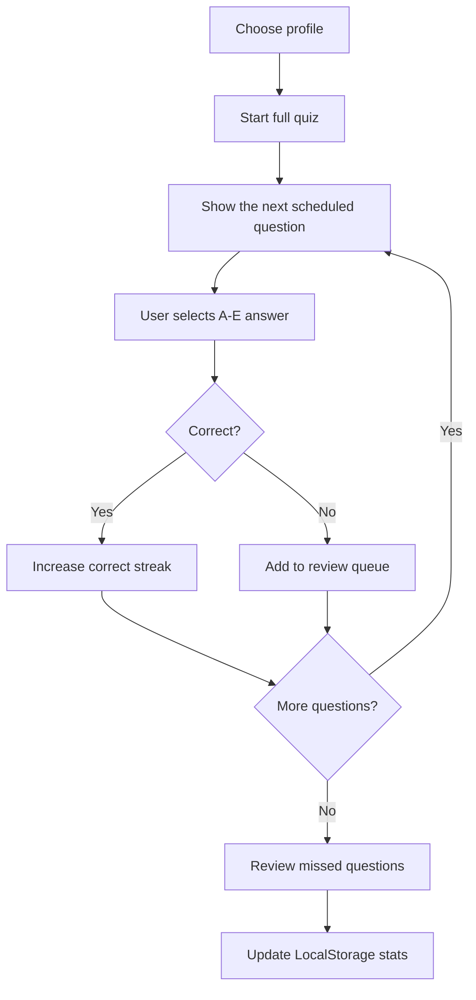

# Quiz Contest

[](#tech-stack)
[](#architecture)
[](#how-it-works)
[](#internationalization)

A fully client-side quiz trainer built for contest preparation. It runs as a static GitHub Pages site, saves study progress in the browser, applies profile-aware question and answer ordering, and uses an Anki-inspired review queue for missed questions.

Live demo: [https://degsterin.github.io/quiz-contest/](https://degsterin.github.io/quiz-contest/)

Repository: [https://github.com/DegsTerin/quiz-contest](https://github.com/DegsTerin/quiz-contest)


## What Makes It Portfolio-Ready

This project demonstrates a complete static web application without a backend. It includes state persistence, dynamic rendering, ordered and randomised sessions, profile switching, bilingual UI controls, and a learning loop inspired by spaced repetition.

The content is tailored to Brazilian public contest preparation, while the interface can be used in Portuguese or English. Portuguese is the default language because the question banks are based on Brazilian exam notices.

## Main Features

| Feature | Description |
| --- | --- |
| Multiple profiles | Switch between two independent study profiles without mixing progress. |
| Question bank | 100 active questions: 40 authored practice questions for Bruno and 60 original FURB questions for Maria. |
| Profile-aware presentation | Bruno's full quiz follows written-exam order with stable A-E alternatives; Maria and review queues retain randomisation. |
| Paper-style alternatives | Answers are displayed as A, B, C, D, and E, like a printed exam. |
| Immediate feedback | Users see whether the answer is correct and get an explanation. |
| Review queue | Missed questions are saved and repeated after the main round. |
| Basic spaced repetition | Correct streaks reduce how often a question appears again. |
| Local persistence | Progress, accuracy, streaks, and review status are stored in LocalStorage. |
| Bilingual experience | Portuguese is default; English translates the interface, questions, alternatives, and feedback into British English. |
| GitHub Pages ready | No build step, no server, no external libraries. |

## How It Works

1. The user selects a profile: Bruno or Maria.
2. The app loads the matching question bank from the static question files.
3. Bruno's full quiz follows written-exam order; other profile and review queues retain their study-oriented randomisation.
4. Each question shows one prompt and five alternatives in the order defined by the active profile and study mode.
5. When the user answers, the app displays immediate feedback.
6. Incorrect answers enter a review queue.
7. After the full round, missed questions come back for review.
8. If a question is answered correctly multiple times, it appears less often.
9. Progress is saved locally in the browser using LocalStorage.

<details>
<summary><strong>Study Flow Diagram</strong></summary>


```mermaid
flowchart TD
  A["Choose profile"] --> B["Start full quiz"]
  B --> C["Show the next scheduled question"]
  C --> D["User selects A-E answer"]
  D --> E{"Correct?"}
  E -->|Yes| F["Increase correct streak"]
  E -->|No| G["Add to review queue"]
  F --> H{"More questions?"}
  G --> H
  H -->|Yes| C
  H -->|No| I["Review missed questions"]
  I --> J["Update LocalStorage stats"]
```

</details>

## Internationalization

The app supports two languages:

| Language | Behavior |
| --- | --- |
| Portuguese | Default language for the complete quiz experience. |
| English | British English translation for the interface, question prompts, alternatives, and feedback. |

The English question bank is stored statically in JavaScript translation files, so the deployed app does not depend on any external translation service at runtime.

## Architecture

```text
quiz-contest/
  index.html       Static HTML structure
  style.css        Responsive styling and visual system
  app.js           Quiz engine, i18n, LocalStorage, review logic
  questions.js     Question banks and profile metadata
  bruno-hard-questions.js
                   Authored IT Technician practice questions for Massaranduba Notice 001/2026
  maria-hard-questions.js
                   Original AEE/Mixed and Libras FURB exam questions
  questions-en.js  English interface support and legacy fallback translations
  bruno-hard-questions-en.js
                   British English translations for Bruno's adapted practice bank
  maria-hard-questions-en.js
                   British English translations for the original AEE/Mixed and Libras bank
  docs/
    quiz-contest-dark-en-gb.gif
                   Animated README demonstration in dark mode and British English
```

No backend is required. The browser loads JavaScript directly, renders the current profile, and persists progress locally.

## Tech Stack

- HTML5
- CSS3
- Vanilla JavaScript
- LocalStorage
- GitHub Pages

## Question Banks

| Profile | Target |
| --- | --- |
| Bruno | Author-created, non-official practice set for IT Technician, Massaranduba Municipal Public Competition Notice 001/2026. |
| Maria | Original FURB objective test for AEE/Mixed and Libras Interpreter teacher roles, SED/SC 793/2026. |

The project currently includes 40 questions for Bruno and 60 questions for Maria, for 100 total questions.

Bruno's bank is an author-created, non-official practice set adapted to the notice's official distribution: 8 Portuguese Language, 8 Mathematics and Logical Reasoning, 4 General Knowledge, and 20 Role-Specific Knowledge questions. Every question has five alternatives and one designated correct answer. The questions are not copied from an official test and the explanations are not an official answer key.

The full Bruno quiz presents these subjects in written-exam sequence: questions 1-8 Portuguese Language, 9-16 Mathematics and Logical Reasoning, 17-20 General Knowledge, and 21-40 Role-Specific Knowledge. Its alternatives use a stable deterministic A-E order that removes the source-key pattern; error-review rounds may still randomise them as a study aid.

Maria's active bank retains the original wording and preliminary FURB answer key from its source objective tests and remains marked as `Original` in the quiz UI.

For transparency, the dashboard shows raw correct-answer counts and accuracy; it does not calculate Bruno's official 100-point result or determine whether the 50-point pass rule was met. The notice assigns 2 points to each Portuguese Language, Mathematics and Logical Reasoning, and General Knowledge question, and 3 points to each Role-Specific Knowledge question, producing subject totals of 16, 16, 8, and 60 points.

## LocalStorage Model

The app stores one progress object per profile. Each question tracks:

- total correct answers
- total incorrect answers
- current correct streak
- last result
- review status
- number of review attempts

This keeps each profile independent while still allowing the same quiz engine to power both. Bruno's storage version was advanced for the new question bank, while Maria's existing storage key remains unchanged.

## Running Locally

Because this is a static app, no installation is required.

```bash
git clone https://github.com/DegsTerin/quiz-contest.git
cd quiz-contest
```

Then open `index.html` in a browser.

You can also use any simple static server:

```bash
python -m http.server 8000
```

Then visit:

```text
http://localhost:8000
```

## GitHub Pages

The app is designed to run directly from the repository root on GitHub Pages:

```text
Branch: main
Folder: /
```

## Design Notes

- The visual style uses warm paper-like tones to evoke a study environment.
- Answer alternatives use circular labels to resemble physical exam sheets.
- The dashboard keeps the learning loop visible: mode, progress, raw correct-answer count, and accuracy.
- The app avoids dependencies so it remains easy to host, inspect, and maintain.

## Future Improvements

- Add import/export for progress backup.
- Add filters by category and difficulty.
- Add notice-weighted score calculation per profile.
- Add charts for accuracy by subject.
- Add keyboard shortcuts for A-E answers.
