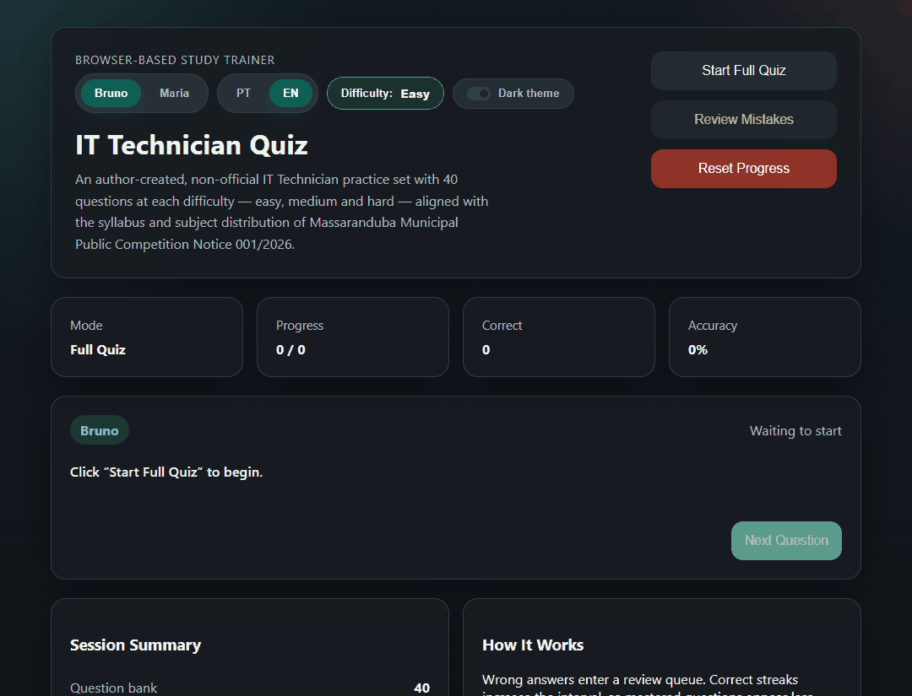

  <h1>Quiz Contest</h1>
  
<strong>A dependency-free, bilingual browser application for Brazilian public-exam preparation, deterministic written-exam sessions and LocalStorage-backed mistake review.</strong>

  

    
    
    
    
    
  

  

    <a href="https://degsterin.github.io/Quiz-Contest/">Open the live application</a>
    ·
    <a href="https://github.com/DegsTerin/Quiz-Contest">Browse the source</a>
  

## Overview

Quiz Contest is a browser-based study application for Brazilian public-service competitions. It combines profile-specific exam sessions, isolated progress, bilingual question banks and a step-based mistake-review loop in a static site that can be deployed without a build pipeline or application server.

The product deliberately keeps its runtime boundary small: the browser renders the interface, runs the quiz engine and stores progress. There is no backend, account system or external service involved in a study session.

| Area | Implementation |
| --- | --- |
| Runtime | Browser-only HTML, CSS and vanilla JavaScript |
| Content | Two profiles and 240 active questions: 120 for Bruno and 120 for Maria |
| Session strategies | Written-exam sequence for Bruno; study-oriented randomisation for Maria and review queues |
| Persistence | Versioned LocalStorage state, isolated by profile and difficulty |
| Localisation | pt-BR by default, with an en-GB experience |
| Delivery | Static hosting through GitHub Pages; no build step |

## Product Capabilities

| Capability | Behaviour |
| --- | --- |
| Independent profiles | Bruno and Maria use separate question banks, progress records and session policies. |
| Three difficulty modes | One top-level button cycles both profiles through Easy → Medium → Hard, with 40 questions in each mode. |
| Written-exam fidelity | Bruno's full quiz follows the order in which subjects appear in the notice matrix and keeps a deterministic A–E answer layout. |
| Study variation | Maria's full quiz and mistake-review queues randomise questions and alternatives. |
| Immediate feedback | Every answer is evaluated in the browser and followed by an explanation. |
| Adaptive mistake review | Incorrect answers are scheduled to reappear; consecutive correct answers clear the review requirement. |
| Durable local progress | Totals, per-question history, selected profile, each profile's difficulty, language and theme survive page reloads. |
| Bilingual interface | Controls, questions, alternatives and explanations are available in pt-BR and en-GB. |
| Responsive themes | The interface supports light and dark themes across desktop and narrow viewports. |
| Zero-install delivery | There are no runtime packages, server processes or environment variables to configure. |

## Study Engine

### Full quiz

A session policy is selected from the active profile:

- Bruno's selected difficulty preserves its authored 1–40 written-exam sequence.
- Bruno's A–E alternatives use a seeded deterministic permutation derived from the question ID. This keeps the layout stable without exposing the answer-key pattern.
- Maria's main queue is randomised and gives greater priority to questions with a lower correct-answer streak.
- Review queues can randomise alternatives so that study recall does not depend on a memorised position.

### Mistake review

The review mechanism is based on answered-question steps, not elapsed time:

1. An incorrect answer marks the question as needing review and schedules it for the next review step.
2. Due review items are shuffled before they are presented.
3. A correct review answer increases the streak and, while the question is not yet mastered, schedules it at a longer step interval.
4. Two consecutive correct answers clear the review requirement.
5. State is saved after every answer.

This is a focused in-session learning loop rather than a time-based spaced-repetition system.

## Question Banks and Provenance

| Profile | Active bank | Main-session behaviour |
| --- | --- | --- |
| Bruno | Three 40-question, original and non-official practice banks aligned with Massaranduba Municipal Public Competition Notice 001/2026 for IT Technician | Easy, Medium or Hard; fixed written-exam order with stable alternatives and isolated progress |
| Maria | Three 40-question banks covering General Knowledge, Teaching Practice Methodology, AEE/Mixed and Libras Interpreting | Easy, Medium or Hard; randomised, streak-aware study order with isolated progress |

### Bruno written-exam sequence

| Question range | Subject | Questions | Notice points each | Notice total |
| --- | --- | ---: | ---: | ---: |
| 1–8 | Portuguese Language | 8 | 2 | 16 |
| 9–16 | Mathematics and Logical Reasoning | 8 | 2 | 16 |
| 17–20 | General Knowledge | 4 | 2 | 8 |
| 21–40 | Role-Specific Knowledge | 20 | 3 | 60 |
| **Total** |  | **40** |  | **100** |

Every question has five alternatives and one designated answer. Each Bruno difficulty follows the same 8/8/4/20 subject distribution, balances the displayed answer key across A–E and avoids runs longer than two identical answer letters. Bruno's questions and explanations are independent study material; they are not copied from an official test and do not constitute an official answer key.

The 1–8, 9–16, 17–20 and 21–40 sequence is an editorial simulation based on the order of subjects in Notice Table 06 and the requested conventional written-exam flow. The notice defines the composition, quantities and weights, but does not guarantee the physical order of questions in the official booklet.

The dashboard intentionally reports raw correct-answer counts and accuracy. It does not calculate the notice-weighted score or determine whether an official pass threshold has been met.

### Bruno editorial method

The 120-question corpus was reviewed through an evidence hierarchy. The notice controls eligibility and structure; previous papers identify recurring topics and editorial patterns but never override the current programme:

- the [current Massaranduba notice and organiser page](https://portal.institutotupy.com.br/edital/ver/97) define the binding 8/8/4/20 composition, programme, five-option format and scoring;
- the [Massaranduba 2020 competition archive](https://concursos.furb.br/informacoes/52/) and a [preserved copy of its complete IT Technician paper](https://www.pciconcursos.com.br/provas/download/tecnico-em-informatica-prefeitura-massaranduba-sc-furb-2020) provide the closest municipal precedent for the same role;
- the complete [Massaranduba 2015 IT Technician paper](https://www.pciconcursos.com.br/provas/download/tecnico-em-informatica-prefeitura-massaranduba-sc-nubes-2015) provides an older local precedent for municipal context and question forms, but its four-option 5/5/5/25 structure is not used as the 2026 matrix;
- the complete [ISSEM Jaraguá do Sul 2024 IT Technician paper](https://www.pciconcursos.com.br/provas/download/tecnico-em-informatica-prefeitura-jaragua-do-sul-sc-issem-instituto-tupy-2024) is the closest preserved same-organiser reference and was used to study Instituto Tupy's concise prompts, statement sets and adjacent technical distractors;
- eight further preserved IT Technician papers formed a broader recurrence panel with the ISSEM paper: Timbó 2024, SAMAE Blumenau 2024, Guabiruba 2024, SAMAE Jaraguá do Sul 2023, Nova Trento 2023 and Doutor Pedrinho 2023 (FURB), plus Dionísio Cerqueira 2025 and Belmonte 2024 (AMEOSC). Across this panel, hardware and networks were the strongest recurring themes, followed by security and Windows/software. Office/web and database topics appeared less often but remain represented because the 2026 notice names them expressly;
- the Instituto Tupy archives for [Massaranduba 2023](https://portal.institutotupy.com.br/edital/ver/30), [São Bento do Sul 2026](https://portal.institutotupy.com.br/edital/ver/79), [Jaraguá do Sul City Council 2024](https://portal.institutotupy.com.br/edital/ver/34) and [ISSEM Jaraguá do Sul 2024](https://portal.institutotupy.com.br/edital/ver/37) were used to compare organiser structures and published decisions;
- local-history and regional-geography statements were checked against the [official Massaranduba tourism history](https://turismo.massaranduba.sc.gov.br/pagina-185/), the municipality's [record of its first and restored administrations](https://servicos.massaranduba.sc.gov.br/pagina-7514/) and [AMVALI's Itapocu watershed overview](https://amvali.org.br/pagina-6747/).

The [Instituto Tupy FAQ](https://portal.institutotupy.com.br/faq) explains that completed question booklets remain available to candidates for only a limited period. Where an official booklet had expired, preserved copies were consulted only to study editorial form and topic recurrence. Source answer letters were not reused: some historical booklets omit the answer key, and repeated common questions can place the same answer in different positions. Every active Bruno item is independently authored, has one reviewed answer and does not reproduce source wording. The project has no affiliation with or endorsement from the organiser or the Municipality of Massaranduba.

Each Bruno bank assigns questions 21–40 to the same primary editorial domains while changing the cognitive demand rather than introducing off-programme content. The subtopics below describe the sampling envelope across the complete 120-question corpus; not every listed subtopic appears separately in every difficulty bank:

| Specific-question range | Primary editorial domain and corpus-level sampling envelope |
| --- | --- |
| 21–24 | Components, buses, memory, processors, interfaces, firmware, storage, assembly, maintenance, cooling, power and UPS equipment |
| 25–28 | Windows 10, file management, Word, Excel, PowerPoint, Outlook, Google Workspace, internet services and browsers |
| 29–30 | Backup, recovery, malware and protective mechanisms |
| 31–37 | Topologies, network equipment and media, OSI/TCP-IP, addressing, protocols, routing, wireless, VoIP, streaming, traffic and security controls |
| 38–40 | DBMS principles, relational concepts, SQL language classes and database objects |

Easy questions test direct recognition and routine operations; Medium questions require practical application and association of concepts; Hard questions combine evidence, calculations or diagnostic decisions. This separation is a study feature, not an official difficulty classification or a guarantee of what will appear in the examination.

### Maria mixed-profile sequence

Each Maria mode contains 10 General Knowledge, 10 Teaching Practice Methodology, 10 AEE/Mixed and 10 Libras Interpreter questions. This is a mixed study profile spanning two specialist tracks, not the distribution of a single official paper.

The Easy and Medium modes contain author-created practice material. The Hard mode selects 40 questions from the preserved 60-question FURB source corpus for SED/SC Notice 793/2026 and retains references to the preliminary answer key.

## Architecture

~~~mermaid
flowchart LR
  Host["GitHub Pages or a static server"] --> UI

  subgraph Browser["Browser runtime"]
    UI["index.html + style.css"]
    Engine["app.js rendering, sessions, review and i18n"]
    Banks["Question-bank and en-GB scripts"]
    State[("Versioned LocalStorage")]

    UI <--> Engine
    Banks --> Engine
    Engine <--> State
  end
~~~

### Runtime boundary

- The application loads classic JavaScript files directly from the static host.
- There is no API, backend, database, server-side session, authentication or authorisation flow.
- The application does not handle credentials, access tokens, refresh tokens, cookies or secrets.
- Progress is not uploaded and there is no cross-device synchronisation.
- Localisation dictionaries ship with the application; no translation API is called at runtime.
- No package manager, framework or build output is required.

## State, Privacy and Security Boundary

The application stores only study state and interface preferences in the current browser origin.

| LocalStorage key | Purpose |
| --- | --- |
| <code>static-quiz-system-state-v6-bruno-easy</code> | Bruno's Easy totals and per-question progress |
| <code>static-quiz-system-state-v6-bruno-medium</code> | Bruno's Medium totals and per-question progress |
| <code>static-quiz-system-state-v6-bruno-hard</code> | Bruno's Hard totals and per-question progress |
| <code>static-quiz-system-state-v3-maria-easy</code> | Maria's Easy totals and per-question progress |
| <code>static-quiz-system-state-v3-maria-medium</code> | Maria's Medium totals and per-question progress |
| <code>static-quiz-system-state-v3-maria-hard</code> | Maria's Hard totals and per-question progress |
| <code>static-quiz-system-active-profile</code> | Last selected profile |
| <code>static-quiz-system-active-difficulty-bruno</code> | Last selected Bruno difficulty |
| <code>static-quiz-system-active-difficulty-maria</code> | Last selected Maria difficulty |
| <code>static-quiz-system-active-language</code> | Last selected language |
| <code>static-quiz-system-theme</code> | Last selected theme |

Per-question state records correct and incorrect totals, the current streak, the last result, whether review is required and the number of review attempts.

<code>Reset Progress</code> removes only the active profile and difficulty's versioned progress record. Every other mode and the interface preferences remain available.

Bruno v6 deliberately starts with fresh progress because the notice-first, cross-paper revision materially changes questions and alternatives; earlier Bruno records remain browser-local but are not imported into the revised banks. Compatible records from Maria's former 60-question v2 bank are filtered to the selected Hard questions and copied once; a migration marker prevents a later reset from importing that legacy progress again.

LocalStorage is browser-local, unencrypted and removable through browser settings. The application does not request sensitive personal data, and progress should not be treated as a portable backup.

## Internationalisation

pt-BR is the default experience. The en-GB mode is implemented with static, ID-based dictionaries:

- interface copy and category labels live in <code>app.js</code>;
- shared and legacy question translations live in <code>questions-en.js</code>;
- active profile translations live in the difficulty-specific Bruno and Maria files;
- <code>maria-mode-translations-en.js</code> applies narrow en-GB spelling normalisation without modifying the preserved source corpus.

Questions, alternatives and explanations switch without restarting the session. Portuguese source passages may remain in Portuguese where the language itself is the subject being assessed.

## Accessibility and Responsive Behaviour

The interface includes practical accessibility and responsive behaviours:

- native button controls for primary actions and alternatives;
- <code>aria-pressed</code> state for profile, language and theme controls;
- a dynamic accessible label on the three-state difficulty button, including the current and next modes;
- polite <code>aria-live</code> announcements for questions and feedback;
- programmatic focus movement when a new question or completion state is rendered;
- visible keyboard focus styling;
- responsive layouts at 840 px and 520 px breakpoints.

These implementation details are not a formal WCAG conformance claim.

## Repository Structure

| Path | Responsibility |
| --- | --- |
| <code>index.html</code> | Semantic page structure, controls and script loading |
| <code>style.css</code> | Responsive layout, design tokens, themes and component states |
| <code>app.js</code> | Rendering, localisation, session scheduling, review logic and persistence |
| <code>questions.js</code> | Question factory, base banks, profile metadata and registry |
| <code>bruno-easy-questions.js</code> | Bruno's Easy Massaranduba IT Technician practice bank |
| <code>bruno-hard-questions.js</code> | Bruno's Medium Massaranduba IT Technician practice bank |
| <code>bruno-difficult-questions.js</code> | Bruno's Hard Massaranduba IT Technician practice bank |
| <code>bruno-question-banks.js</code> | Bruno difficulty registry and Medium metadata normalisation |
| <code>maria-easy-questions.js</code> | Maria's author-created Easy practice bank |
| <code>maria-hard-questions.js</code> | Preserved 60-question FURB source corpus |
| <code>maria-question-banks.js</code> | Maria difficulty registry and 40-question Medium/Hard selections |
| <code>questions-en.js</code> | Shared and legacy en-GB question translations |
| <code>bruno-easy-questions-en.js</code> | en-GB translations for Bruno's Easy bank |
| <code>bruno-hard-questions-en.js</code> | en-GB translations for Bruno's Medium bank |
| <code>bruno-difficult-questions-en.js</code> | en-GB translations for Bruno's Hard bank |
| <code>maria-easy-questions-en.js</code> | en-GB translations for Maria's Easy bank |
| <code>maria-hard-questions-en.js</code> | Preserved translations for Maria's FURB source corpus |
| <code>maria-mode-translations-en.js</code> | Runtime en-GB spelling normalisation for selected Maria questions |
| <code>scripts/validate-question-banks.js</code> | Dependency-free regression checks for bank, translation, ordering, answer-key and preservation invariants |
| <code>docs/quiz-contest-dark-en-gb.gif</code> | Animated README demonstration |
| <code>LICENSE</code> | MIT licence terms and copyright notice |

## Run Locally

No dependency installation is required.

~~~bash
git clone https://github.com/DegsTerin/Quiz-Contest.git
cd Quiz-Contest
python -m http.server 8000
~~~

Open <http://localhost:8000> in a browser.

Opening <code>index.html</code> directly is also supported by the current architecture, but a local static server more closely matches the deployed HTTP environment.

## Deployment

The live application is available at [degsterin.github.io/Quiz-Contest](https://degsterin.github.io/Quiz-Contest/).

The repository keeps <code>index.html</code> and all runtime assets at the root, so the same files can be served by GitHub Pages or another static host. There is no compilation step or generated distribution directory.

## Engineering Decisions

| Decision | Rationale | Trade-off |
| --- | --- | --- |
| Static browser-only architecture | Minimises deployment and operational complexity | No accounts, server validation or cross-device synchronisation |
| Versioned per-profile LocalStorage | Prevents unrelated profiles and incompatible bank revisions from sharing state | Progress remains tied to one browser and breaking revisions may start with fresh state |
| Difficulty-isolated state | Switching difficulty preserves independent totals and review history for both profiles | Each profile and difficulty has its own browser-local record |
| Profile-specific session policies | Preserves written-exam fidelity for Bruno while retaining study variation for Maria | The engine must maintain both deterministic and randomised paths |
| Seeded Bruno answer ordering | Produces a stable paper-style A–E layout without exposing the source-key sequence | Deliberate reshuffling requires a seed or question-ID change |
| Static localisation dictionaries | Removes runtime translation dependencies and keeps copy reviewable in source control | Translation parity must be maintained when content changes |

## Development Quality Gate

The repository includes a dependency-free question-bank regression script but does not require a package manifest or build pipeline. Run it with:

~~~bash
node scripts/validate-question-banks.js
~~~

A safe content or engine change should also include:

- JavaScript syntax checks for every script;
- a browser smoke test in pt-BR and en-GB;
- a full-session check for both profiles;
- the checked-in bank validation, which covers all six modes, counts, order, answer balance and runs, five-option shape, IDs, translation coverage and Maria source preservation;
- a LocalStorage version-isolation check across both profiles and Maria's compatible legacy migration.

Running these checks through CI is the highest-priority engineering improvement.

## Roadmap

- Run the regression suite through GitHub Actions.
- Add progress export and import.
- Add subject-level filters, analytics and keyboard shortcuts.

## Licence

Quiz Contest is released under the [MIT License](LICENSE).

Copyright (c) 2026 Bruno Araújo - DegsTerin.

## Disclaimer

Quiz Contest is an independent educational project. Bruno's profile and Maria's Easy/Medium modes are author-created and non-official. Maria's Hard mode selects preserved source-exam wording and a preliminary answer key. Candidates should always consult the applicable notice, amendments and final official answer key as the authoritative sources.

## Maintainer

Built and maintained by [DegsTerin](https://github.com/DegsTerin).
